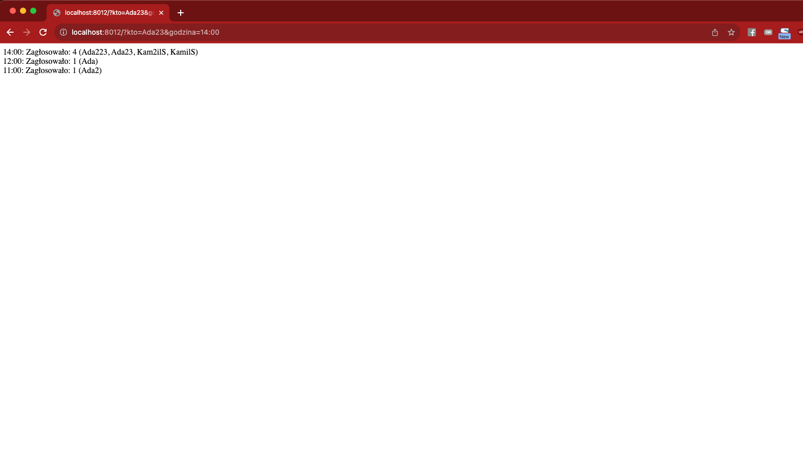

## Opisy do zadan 1 - 3 znajduja sie w plikach tak samo jak rowiazania 

# Zadanie 4
Jest dodane do folderu `zadanie4` 

Co moge o nim powiedziec:
- Dodalem podzial na repozytoria do zarzadzania danymi
- Dane sa zapisywane w pliku json zgodnie z imieniem uzytkownika 
- Mamy servis do pobierania danych i zapisu 
- Dane na stronie sortowane sa po liczbie uzuwtkownikow ktora zaglosowala

Nie dodawałem systemu routingu, poniewaz nie bylo to wymagane w zadaniu

Aplikacja staruje z pliku index.php 
Nie pracuje na Apache, wiec nie ma potrzeby dodawania .htaccess

Wyglada to tak:
